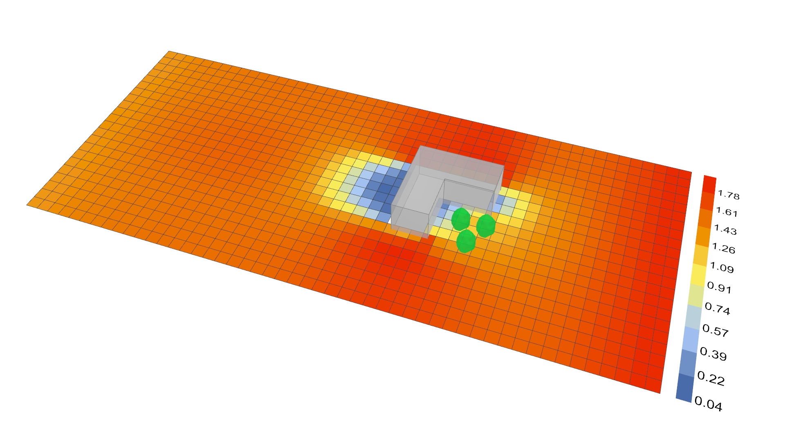

# Assessing and Calibrating Simulation Parameters for the urbanMicroclimateSolver (UMCF) Plugin

This repository contains everything needed to reproduce the comparison and validation of the Grasshopper-based urbanMicroclimateSolver (UMCF) plugin against ENVI-met, as presented in “Assessing and Calibrating Simulation Parameters for the urbanMicroclimateSolver UMCF plugin for Grasshopper: a comparison and validation with ENVI-met”



### ARCH-8833-Sp25-UMCFvsENVImet


- **analysis.py**  
  Python script to load ENVI-met and UMCF output CSVs, compute statistics (MBE, MAE, RMSE, NMAE, Pearson r, IOA, FB, FAC2), and generate comparative plots.

- **morpho_envimet.gh**  
  Grasshopper definition that:  
  1. Builds the 3D mesh (via Morpho) from a toy case geometry  
  2. Exports to ENVI-met input format  
  3. Sets up the UMCF “Outdoor+” Grasshopper component with matching tree and environmental parameters.

- **data/**  
  - `USA_GA_Fulton.County.AP-Brown.Field.722195_TMY3.epw` – TMY3 weather file for Fulton County, GA :contentReference[oaicite:8]{index=8}&#8203;:contentReference[oaicite:9]{index=9}.  

## Requirements

- **Software**:  
  - Rhino 7 + Grasshopper 3D  
  - Morpho plugin  
  - ClimateStudio UMCF – Outdoor+ component  
  - ENVI-met (v4 or later)  
- **Python** (>= 3.8) with:
  - pandas  
  - numpy  
  - matplotlib  

## Usage

1. **Prepare environment**  
   - Clone this repository.  
   - Install Python requirements:  
     ```bash
     pip install pandas numpy matplotlib
     ```  

2. **Run Grasshopper simulations**  
   - Open `morpho_envimet.gh` in Grasshopper.  
   - Update the paths to your local EPW file and output folder.  
   - Bake geometry or export as required for ENVI-met.  
   - Run ENVI-met (00:00–20:00, evaluate at 14:00) and save CSV outputs.  
   - In the same GH file, configure the UMCF component with matching parameters and export UMCF CSV.

3. **Analyze results**  
   - Execute:
     ```bash
     python analysis.py
     ```
   - Check `results/` for comparative plots and a summary table of statistics (MBE, RMSE, Pearson r, IOA, FB, FAC2).

## Key Findings (from presentation)

- **Temperature**: UMCF overestimates mean air temperature by ~0.78 °C; low Pearson r (0.06) but acceptable RMSE (0.0011) :contentReference[oaicite:12]{index=12}&#8203;:contentReference[oaicite:13]{index=13}.  
- **Humidity**: Very close agreement due to low absolute values; UMCF RMSE ~0.0010 g/kg :contentReference[oaicite:14]{index=14}&#8203;:contentReference[oaicite:15]{index=15}.  
- **Wind Speed**: UMCF underestimates by ~0.5–0.9 m/s (RMSE up to 1.28 m/s), indicating need to refine initial/boundary conditions :contentReference[oaicite:16]{index=16}&#8203;:contentReference[oaicite:17]{index=17}.

## Future Work

- Match cloud coverage and sky model between both tools.  
- Refine tree-property calibration (LAD, transmittance) for better wind prediction.  
- Extend validation to additional case studies.


**Author**: Marcelo Álvarez  
**Advisor**: Pr. Patrick Kastner, Ph.D.  
**Date**: April 2025  
